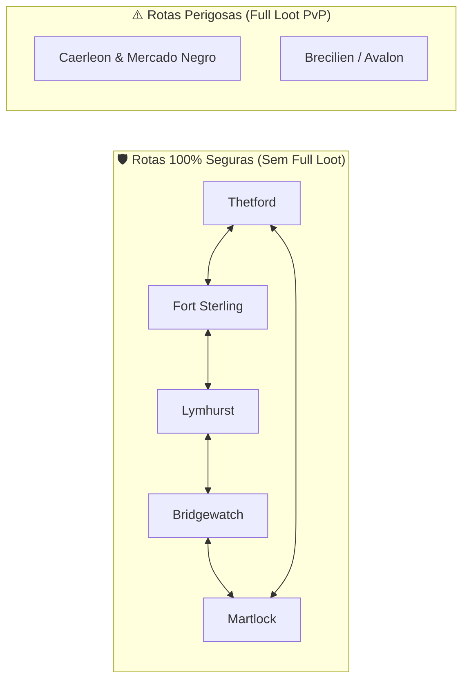
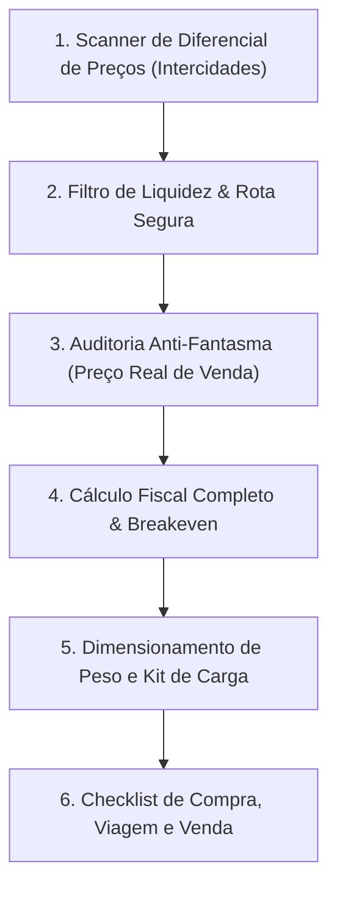

# 🚚 Albion Online — Co-piloto de Arbitragem & Transporte Intercidades

Esta skill transforma o agente em um **Operador Logístico e Especialista em Arbitragem Intercidades** no Albion Online.

O objetivo central é lucrar com o diferencial de preços de compra e venda entre praças, priorizando rotas comerciais sem risco de perda de carga (Continente Real) e rotas de alta margem protegidas por travas fiscais e anti-fantasma.

---

## 🗺️ Classificação de Rotas por Perfil de Risco



| Categoria | Cidades | Risco de Perda | Tipo de Montaria Recomendada |
| :--- | :--- | :--- | :--- |
| **100% Segura** | Thetford, Fort Sterling, Lymhurst, Martlock, Bridgewatch | **Zero Risco de Capital** (*Knockdown* apenas, sem perda de itens) | Boi T5 a T8 / Mamute de Transporte |
| **Zona Vermelha** | Caerleon / Mercado Negro | **Perda Total (Full Loot)** se abatido por jogadores hostis | Cavalo Rápido / Garra-ligeira / Batedor avançado |

---

## 🛡️ Salvaguardas Anti-Alucinação & Regras Fiscais

1. **Trava Anti-Ordem Fantasma (*Anti-Phantom*):**
   - Se o menor preço de venda listado na cidade de destino for $> 45\%$ superior à média histórica real dos últimos 7 dias, **NUNCA** projete a receita pelo preço listado.
   - Aplique o teto seguro de $+15\%$ sobre a média histórica real.

2. **Cálculo Rigoroso de Ponto de Equilíbrio (*Breakeven Price*):**
   $$\text{Custo Efetivo Compra} = \text{Preço Compra} \times (1 + 0,025 \text{ [se Ordem de Compra]})$$
   $$\text{Preço Mínimo de Venda (Breakeven)} = \frac{\text{Custo Efetivo Compra}}{1 - \text{Taxa Venda} - 0,025}$$
   *(Onde Taxa de Venda = 4% com Premium ou 8% sem Premium)*.

3. **Portão de Liquidez Diária:**
   - Exija volume mínimo histórico ($\ge 1.0$ venda/dia) para evitar capital retido em itens com liquidez artificial.

4. **Dimensionamento de Carga (kg):**
   - Antes de confirmar a viagem, verifique o peso total de itens contra a capacidade combinada:
   $$\text{Capacidade Total} = (\text{Carga}_{\text{Montaria}} + \text{Carga}_{\text{Bolsa}} + 50) \times (1 + \%_{\text{Torta}}) \times (1 + \%_{\text{Passiva Bota}})$$
   - Jamais permita que o peso ultrapasse 100% da capacidade total recomendada.

---

## 🔄 Fluxo de Trabalho da Arbitragem



### Ferramentas MCP a Utilizar:
- `albion_find_arbitrage_opportunities`: Localiza oportunidades com spread positivo entre cidades de origem e destino.
- `albion_calculate_breakeven_price`: Determina o valor exato mínimo de venda para evitar prejuízo após taxas.
- `albion_audit_quote_freshness_and_phantom`: Valida frescor da cotação e detecta desvios de ordens fantasmas.
- `albion_calculate_exact_loadout_capacity`: Garante que a quantidade cabe na montaria sem sobrecarga.

---

## 🛠️ Script CLI Dedicado

Para escanear arbitragens rapidamente:
```bash
python .agents/skills/albion-arbitrage-copilot/scripts/scan_arbitrage.py --origin Thetford --destination Martlock --min-profit 50000 --safe-only
```
