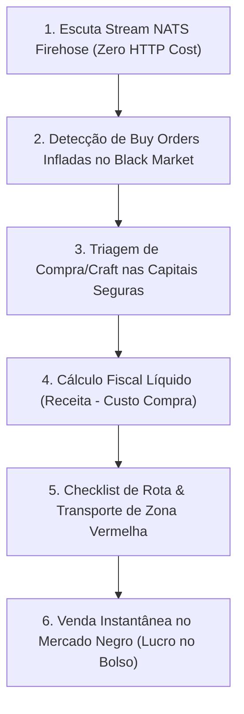

# 🏴‍☠️ Albion Online — Sniper & Exportador do Mercado Negro (Caerleon)

Esta skill transforma o agente em um **Especialista em Exportação para o Mercado Negro de Caerleon (Black Market)**.

O Black Market é uma entidade econômica controlada pelo próprio sistema do jogo que adquire equipamentos para abastecer as tabelas de *drops* de monstros, masmorras e baús em toda Albion.

---

## ⚠️ Regras Críticas de Operação no Black Market

> [!IMPORTANT]
> **REGRA DE OURO DO BLACK MARKET:**
> 1. O Mercado Negro é **EXCLUSIVAMENTE PARA VENDA DE ITENS**.
> 2. Jogadores **NUNCA PODEM COMPRAR ITENS NO MERCADO NEGRO**.
> 3. O jogador vende equipamentos diretamente para preencher as *Buy Orders* geradas pelo sistema do jogo.
> 4. **Mecânica de Preço Ascendente:** Quando baús ou monstros precisam de um item e não há estoque, o preço da *Buy Order* **sobe continuamente** a cada minuto até que um jogador forneça o item.

### Escopo de Itens Aceitos:
- ✅ **Aceita:** Equipamentos de combate (Armas, Armaduras, Elmos, Botas, Secundários), Bolsas e Capas.
- ❌ **Rejeita:** Recursos brutos ou refinados (barras, couros, tecidos), consumíveis (comidas/poções) e insumos de encantamento (runas/almas/relíquias).

### Vantagem Fiscal na Venda Direta:
- Vendas diretas para *Buy Orders* abertas pagam **estritamente a Taxa de Transação**:
  - **4,0%** com Premium
  - **8,0%** sem Premium
- **SEM COBRANÇA DE SETUP FEE (2,5%)** em vendas instantâneas para ordens do sistema.

---

## 🔴 Gestão de Risco em Zonas Vermelhas (Caerleon)

Caerleon é cercada por Zonas Vermelhas onde o PvP de **Perda Total (Full Loot)** está ativo:

1. **Protocolo de Carga Fracionada:**
   - Nunca transporte todo o seu capital em uma única viagem. Limite o valor da carga a um teto razoável (ex: até 2M a 5M de prata por viagem).
2. **Montarias Recomendadas para Transporte Seguro:**
   - **Cavalo Blindado T5/T6:** Alta resiliência contra gankers e proteção de CC.
   - **Garra-ligeira (Swiftclaw):** Velocidade máxima para cruzar mapas rapidamente.
   - **Salamandra do Pântano (Swamp Dragon):** Mantém 100% da velocidade mesmo sob ataque contínuo.
3. **Contador de Hostis:**
   - Sempre verifique o contador de jogadores hostis (*red players flagged*) no canto inferior direito ao entrar em cada mapa vermelho. Se houver $\ge 4$ hostis no mapa, contorne ou aguarde na borda.

---

## 🔄 Fluxo Operacional: *Stream NATS → Aquisição Segura → Entrega Caerleon*



### Ferramentas MCP a Utilizar:
- `albion_nats_get_live_orders`: Captura ordens em tempo real via NATS (< 60s) especificando `location="Black Market"`.
- `albion_calculate_tax_and_fees`: Cálculo de margem líquida com `is_instant_sell=True` (sem setup fee).
- `albion_get_current_prices`: Busca dos preços de aquisição nas 5 capitais reais para o mesmo item.

---

## 🛠️ Script CLI Dedicado

Para monitorar ordens ao vivo do Black Market via NATS:
```bash
python .agents/skills/albion-black-market-sniper/scripts/snipe_black_market.py --min-price 30000 --limit 15
```
