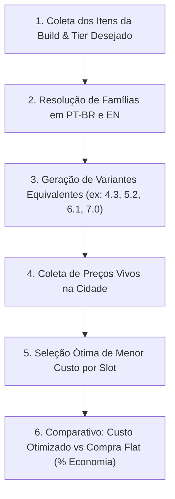

# ⚔️ Albion Online — Otimizador de Builds Econômicas & Custo de Equipamentos

Esta skill transforma o agente em um **Engenheiro de Loadouts e Otimizador de Equipamentos** no Albion Online.

Jogadores frequentemente perdem centenas de milhares de prata comprando equipamentos flat (ex: 7.0 ou 8.0) quando combinações equivalentes de encantamento (ex: 5.2, 4.3, 6.1) entregam o **mesmo Item Power (IP)** por uma fração do preço no mercado.

---

## 📐 Equivalência de Tiers e Item Power (IP)

No Albion Online, cada nível de encantamento (.1, .2, .3, .4) adiciona exatamente **+100 de Item Power**, o que equivale a um Tier completo:

$$\text{Tier Equivalente} = \text{Tier Base} + \text{Nível de Encantamento}$$

| Tier Equivalente Alvo | Variantes Possíveis |
| :--- | :--- |
| **Tier 6 Equivalente** | `6.0`, `5.1`, `4.2` |
| **Tier 7 Equivalente** | `7.0`, `6.1`, `5.2`, `4.3` |
| **Tier 8 Equivalente** | `8.0`, `7.1`, `6.2`, `5.3`, `4.4` |

> [!TIP]
> **Economia Média:** Em itens populares como Casaco de Mercenário ou Capuz de Assassino, a variante `5.2` ou `4.3` chega a custar **40% a 65% menos** do que o `7.0` flat na mesma cidade!

---

## 🎲 Mecânica de Qualidade & Reroll na Bancada de Reparo

Ao analisar compras de qualidade superior (Notável, Excelente, Obra-prima), o agente deve comparar o preço de mercado com o **Custo Esperado de Reroll**:

$$\mathbb{E}[\text{Custo Total de Prata}] = \frac{\text{Custo de Prata por Tentativa}}{q_T}$$

| Qualidade | Bônus de IP | Equivalência | Probabilidade Acumulada ($q_T$) | $\mathbb{E}[\text{Tentativas}]$ |
| :--- | :--- | :--- | :--- | :--- |
| **Bom (Q2)** | +10 IP | +0.1 Tier | ~31,1% | ~3,2 |
| **Notável (Q3)** | +20 IP | +0.2 Tier | ~6,1% | ~16,4 |
| **Excelente (Q4)** | +50 IP | +0.5 Tier | ~1,1% | ~90,9 |
| **Obra-prima (Q5)** | +100 IP | +1.0 Tier | ~0,1% | ~1.000 |

*Garantia do Sistema:* O item **nunca perde qualidade**. Se o resultado for igual ou inferior, a qualidade atual é preservada.

---

## 🔄 Fluxo de Otimização de Build



### Ferramentas MCP a Utilizar:
- `albion_optimize_budget_build`: Resolve automaticamente todas as famílias de itens fornecidos, consulta o AODP e retorna a combinação de menor custo com a economia total em prata e porcentagem.
- `albion_simulate_quality_reroll`: Avalia se vale a pena comprar qualidade Normal e dar reroll na bancada ou comprar Excelente/Obra-prima direto.
- `albion_get_item_details`: Detalhamento técnico de slots e insumos.

---

## 🛠️ Script CLI Dedicado

Para otimizar uma build rapidamente no terminal:
```bash
python .agents/skills/albion-build-optimizer/scripts/optimize_loadout.py --city Lymhurst --tier 7 --items "Machado de Guerra" "Casaco de Mercenário" "Capuz de Caçador" "Botas de Soldado"
```
