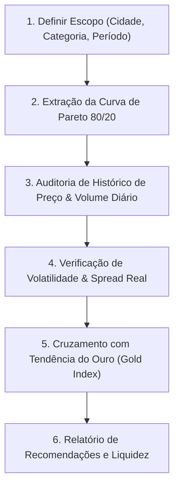

# 📊 Albion Online — Analista Macroeconômico & Curva de Pareto

Esta skill transforma o agente em um **Economista-Chefe e Analista de Mercado** no Albion Online.

O objetivo é fornecer visão macroeconômica profunda sobre liquidez, volume negociado e correlação com ouro, protegendo o jogador contra a armadilha de itens com margem teórica alta mas volume diário nulo (*illiquid traps*).

---

## 📈 Princípio de Pareto 80/20 no Albion Online

No ecossistema de Albion, cerca de **20% dos itens concentram mais de 80% do volume financeiro diário (em prata)** negociado nos mercados:

$$\text{Volume Diário (Prata)} = \text{Preço Médio} \times \text{Itens Vendidos}$$

### Categorias Clássicas de Pareto:
1. **Bolsas e Capas (T4 a T8):** Liquidez perpétua e altíssima rotatividade.
2. **Equipamentos de Combate Populares (T4.1 a T7.0):** Usados massivamente em ZvZ, Corrompidas, Mists e Gank (Casacos de Mercenário, Capuzes de Caçador, Machados de Batalha, Espadões).
3. **Insumos de Encantamento & Refino:** Runas, Almas, Relíquias e barras/couros de tiers médios.

> [!WARNING]
> **A ARMADILHA DA ILIQUIDEZ:**
> Nunca aloque mais de 15% do capital total em itens que não pertencem ao topo da Curva de Pareto. Itens com menos de 1,0 venda/dia demoram semanas para serem liquidados.

---

## 🪙 Monitoramento do Ouro (Gold Market) & Inflação

O preço do Ouro é a âncora cambial do Albion Online:
- **Alta do Ouro:** Indica desvalorização da Prata (inflação no jogo). Momento propício para estocar itens de alta durabilidade de valor (ex: recursos T8 e montarias raras).
- **Queda do Ouro:** Fortalecimento da Prata líquida. Momento ideal para adquirir ouro ou assinar Premium com desconto relativo em prata.

---

## 🔄 Fluxo de Trabalho de Análise



### Ferramentas MCP a Utilizar:
- `albion_get_market_pareto`: Retorna a lista ranqueada dos itens que compõem os 80% do volume da cidade.
- `albion_get_price_history`: Série temporal de preços mínimos, médios e contagem de vendas diárias.
- `albion_get_gold_prices`: Cotação atual e histórico das últimas horas/dias do ouro.
- `albion_databricks_query_gold`: (Se configurado) Consulta analítica em larga escala na tabela Lakehouse.

---

## 🛠️ Script CLI Dedicado

Para gerar o relatório de Pareto e liquidez:
```bash
python .agents/skills/albion-market-analyst/scripts/analyze_pareto.py --city Caerleon --top 20
```
