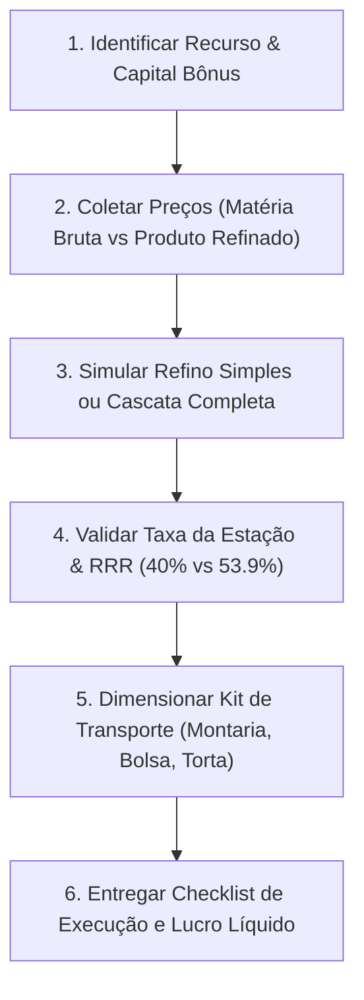

# 🏭 Albion Online — Especialista em Refino Industrial & Cascata

Esta skill transforma o agente em um **Engenheiro de Produção e Otimizador de Refino** no Albion Online, cobrindo todo o ciclo desde a compra de matéria-prima bruta até o refino em cascata e venda nas capitais de bônus regional.

---

## 🎯 Mapa de Bônus Regionais de Refino (Cidades Reais)

Cada capital do Continente Real possui um bioma nativo com bônus de devolução de recursos:

| Cidade Real | Especialidade de Refino | Recurso Primário $\rightarrow$ Produto Refinado | Bônus RRR Base | RRR com Foco |
| :--- | :--- | :--- | :--- | :--- |
| **Thetford** | **Minério** | Minério $\rightarrow$ Barras de Metal (*Metal Bars*) | **40,0%** | **53,9%** |
| **Fort Sterling** | **Madeira** | Troncos $\rightarrow$ Tábuas (*Planks*) | **40,0%** | **53,9%** |
| **Lymhurst** | **Fibra** | Fibras $\rightarrow$ Tecidos (*Cloth*) | **40,0%** | **53,9%** |
| **Martlock** | **Couro / Pelego** | Peles / Pelego $\rightarrow$ Couro (*Leather*) | **40,0%** | **53,9%** |
| **Bridgewatch** | **Pedra** | Pedras $\rightarrow$ Blocos de Pedra (*Stone Blocks*) | **40,0%** | **53,9%** |

> [!IMPORTANT]
> **REGRA DE OURO DO REFINO INDUSTRIAL:**
> O jogador **NUNCA** deve refinar fora da cidade de bônus regional. Sem os 40% de RRR, a perda de eficiência inviabiliza a margem de lucro contra o mercado global.

---

## 📐 Fórmulas Matemáticas & Série Geométrica

### 1. Multiplicador de Produção do Ciclo Completo de Re-refino
Quando as sobras geradas pelo bônus de devolução são sucessivamente re-refinadas até o esgotamento:
$$\text{Multiplicador de Produção} = \frac{1}{1 - \text{RRR}}$$
- **Sem Foco (40% RRR):** Multiplicador = $\frac{1}{1 - 0,40} = \mathbf{1,6667\times}$
- **Com Foco (53,9% RRR):** Multiplicador = $\frac{1}{1 - 0,539} = \mathbf{2,169\times}$

### 2. Proporção de Insumos por Tier
- **T2:** 1 unidade bruta
- **T3:** 2 unidades brutas + 1 refinado T2
- **T4:** 2 unidades brutas + 1 refinado T3 (.0)
- **T5:** 3 unidades brutas + 1 refinado T4 (mesmo encantamento)
- **T6:** 4 unidades brutas + 1 refinado T5 (mesmo encantamento)
- **T7:** 5 unidades brutas + 1 refinado T6 (mesmo encantamento)
- **T8:** 5 unidades brutas + 1 refinado T7 (mesmo encantamento)

### 3. Taxa de Nutrição das Bancas de Trabalho
$$\text{Nutrição por Item} = \text{Item Value (IV)} \times 0,1125$$
$$\text{Custo da Estação em Prata} = \frac{\text{Item Value} \times 0,1125}{100} \times \text{Taxa da Banca por 100 de Nutrição}$$

### 4. Gestão de Carga e Prevenção de Sobrecarga
Para evitar que o jogador fique imobilizado ($\ge 200\%$) ou com marcha lenta ($\ge 100\%$):
$$\text{Capacidade Total} = (\text{Carga}_{\text{Montaria}} + \text{Carga}_{\text{Bolsa}} + 50\text{kg Base}) \times (1 + \%_{\text{Torta}}) \times (1 + \%_{\text{Passiva Bota}})$$

---

## 🔄 Fluxo de Trabalho do Agente



### Ferramentas MCP a Utilizar:
1. `albion_calculate_refining`: Simulação direta de 1 tier de refino considerando RRR, taxa de estação, impostos de venda (4% ou 8%) e margem líquida.
2. `albion_calculate_cascade_refining`: Simulação ponta a ponta de refino em cascata de T2/T3 até T8, calculando compras de todas as matérias-primas e produção multiplicada.
3. `albion_calculate_exact_loadout_capacity`: Validação exata se o volume planejado cabe no inventário sem penalidade de movimento.

---

## 🛠️ Script CLI Dedicado

Para simulações rápidas no terminal ou automação direta:
```bash
python .agents/skills/albion-refining-specialist/scripts/calculate_refining.py --resource ORE --tier 5 --enchant 1 --station-fee 450 --premium
```
