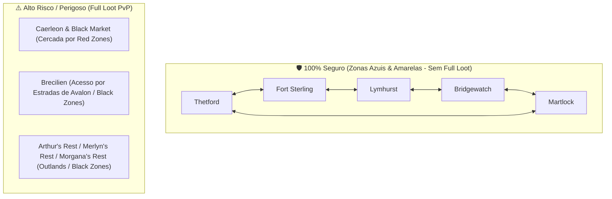

# Regras de Negócio e Economia — Albion Online

> **Documento Oficial e Único de Regras de Negócio do Ecossistema Albion Online**  
> **Status:** ✅ Validado e Consolidado  
> **Fontes:** Mecânicas in-game, Albion Online Data Project (AODP), Databricks Gold History Features e Albion Safe Suite.

---

## 1. Taxas de Mercado e Operações Financeiras

| Operação / Taxa | Quando Ocorre | Sem Premium | Com Premium | Observações |
|---|---|---|---|---|
| **Setup Fee (Taxa de Postagem)** | Ao criar uma ordem (compra ou venda) ou editar preço | **2,5%** | **2,5%** | Não reembolsável. Cobrada no ato da criação ou renovação/ajuste de preço. |
| **Transaction Tax (Taxa de Venda)** | Quando o item é efetivamente vendido | **8,0%** | **4,0%** | Descontada do valor bruto creditado ao vendedor. |
| **Instant Buy (Compra Direta)** | Compra direta de uma *Sell Order* existente no mercado | *Sem Setup Fee* | *Sem Setup Fee* | O comprador paga estritamente o valor listado. |
| **Instant Sell (Venda Direta)** | Venda imediata para uma *Buy Order* existente no mercado | **8,0%** | **4,0%** | Vendedor paga apenas a *Transaction Tax*; não paga *Setup Fee*. |

> [!NOTE]
> **Premissa Padrão do Sistema (*Default Conservative Setting*):**  
> Por padrão, todos os motores analíticos (FastAPI, Polars Engine, simuladores e páginas Streamlit) operam configurados em **Sem Premium (8,0% de Taxa de Venda)**. O usuário pode alternar dinamicamente para o regime **Com Premium (4,0% de Taxa de Venda)** a qualquer momento via controle lateral ou parâmetros da API.

### Fórmulas Matemáticas de Pipeline

```python
# 1. Compra via Ordem de Compra (Buy Order) com N renovações/edições de preço
custo_efetivo_compra_ordem = preco_bid * (1 + 0.025 * (1 + n_renovacoes_compra))

# 2. Compra Direta (Instant Buy de Sell Order)
custo_efetivo_compra_direta = preco_vendedor_minimo

# 3. Venda via Ordem de Venda (Sell Order) com N renovações/edições de preço
taxa_venda = 0.04 if has_premium else 0.08
receita_liquida_venda_ordem = preco_venda * (1 - taxa_venda - 0.025 * (1 + n_renovacoes_venda))

# 4. Venda Direta (Instant Sell em Buy Order)
receita_liquida_venda_direta = preco_comprador_maximo * (1 - taxa_venda)
```

---

## 2. Mercado Negro de Caerleon (*Black Market*)

O Mercado Negro é uma entidade econômica gerida pelo próprio sistema do jogo que adquire equipamentos para abastecer as tabelas de drop de monstros, masmorras e baús em todo o mundo do Albion:

> [!IMPORTANT]
> **REGRA CRÍTICA DE OPERAÇÃO NO BLACK MARKET:**
> O Mercado Negro é **EXCLUSIVAMENTE PARA VENDA DE ITENS**.
> Jogadores **NÃO PODEM COMPRAR ITENS NO MERCADO NEGRO**.
> O fluxo do jogador no Black Market é estritamente unidirecional: vender itens para preencher as *Buy Orders* geradas pelo sistema.

1. **Geração Dinâmica de Ordens de Compra (*System Buy Orders*):**
   * Quando monstros ou baús precisam de um item de determinado tier/qualidade e o cofre do jogo está sem estoque, o Mercado Negro cria uma *Buy Order*.
   * Se a ordem não for atendida por jogadores, o preço de compra **sobe continuamente ao longo do tempo** até que um jogador decida vender o item.
2. **Taxas no Mercado Negro:**
   * O jogador que executa a venda direta para a *Buy Order* do Black Market paga apenas a **Transaction Tax** (**4%** com premium / **8%** sem premium).
   * Não há cobrança de *Setup Fee* de postagem para vendas diretas nas ordens abertas da máquina.
3. **Escopo de Itens:**
   * O Mercado Negro aceita apenas **Equipamentos de Combate (Armas, Armaduras, Elmos, Botas, Secundários)**, **Bolsas** e **Capas**.
   * **Não aceita:** Recursos refinados brutos (couro, barras, tecidos), consumíveis (poções, comidas) ou materiais de encantamento (runas, almas, relíquias).

---

## 3. Encantamento de Itens (*Artifact Foundry*)

O encantamento ocorre na *Artifact Foundry* (localizada nas cidades reais e hideouts) e não exige maestria nem consome foco.

* **Tiers Elegíveis:** Exclusivamente itens de **Tier 4 a Tier 8**.
* **Progressão Obrigatória e Sequencial:**
  * $\text{X.0} \rightarrow \text{X.1}$: Consome **Runas** (do mesmo Tier do item).
  * $\text{X.1} \rightarrow \text{X.2}$: Consome **Almas** (do mesmo Tier do item).
  * $\text{X.2} \rightarrow \text{X.3}$: Consome **Relíquias** (do mesmo Tier do item).
* **Itens .4 (Prístino / *Awakened*):** Não são obtidos por encantamento regular com relíquias; são gerados a partir do craft direto com recursos .4.
* **Montarias:** Montarias de transporte e combate **não são encantáveis** por runas/almas/relíquias.
* **Efeito no Item:** Cada estágio de encantamento concede exatamente **+100 de Item Power (IP)**.

### Tabela Oficial de Consumo por Slot (Múltiplos de 96)

A quantidade de materiais consumidos em cada etapa (.1, .2 e .3) é fixa e proporcional aos slots de materiais de confecção:

| Categoria do Equipamento | Exemplos de Itens | Consumo por Nível (Runas / Almas / Relíquias) |
|---|---|---|
| **Arma de 2 Mãos (2H)** | Espadão, Machadão, Cajados 2H, Arcos, Bestas 2H, Lanças 2H | **384** (4 slots) |
| **Arma de 1 Mão (1H)** | Espada Larga, Machado de Guerra, Adaga, Besta Leve, Cajados 1H | **288** (3 slots) |
| **Armadura de Peito (Armor)** | Robe de Erudito/Clérigo, Casaco de Mercenário, Armadura de Soldado | **192** (2 slots) |
| **Bolsa de Transporte (Bag)** | Todas as Bolsas T4..T8 | **192** (2 slots) |
| **Cabeça (Helmet / Hood / Cowl)** | Elmo de Soldado, Capuz de Mercenário, Capote de Erudito | **96** (1 slot) |
| **Sapatos (Boots / Shoes / Sandals)** | Botas de Soldado, Sapatos de Caçador, Sandálias de Mago | **96** (1 slot) |
| **Secundário (Off-hand)** | Escudo, Tomo de Feitiços, Tocha, Trompa de Batalha | **96** (1 slot) |
| **Capa (Cape)** | Capas Comuns (levam **96 materiais T4**) e Capas de Facção | **96** (1 slot) |

---

## 4. Qualidades de Itens e Mecânica de Reroll

Todo equipamento craftado ou dropado possui um modificador de qualidade:

| Nível | Qualidade (PT-BR) | Nome em Inglês | Bônus de IP | Equivalência de Tier |
|---|---|---|---|---|
| **1** | Normal | *Normal* | +0 | Base do Tier |
| **2** | Bom | *Good* | +10 | +0.1 Tier |
| **3** | Notável | *Outstanding* | +20 | +0.2 Tier |
| **4** | Excelente | *Excellent* | +50 | +0.5 Tier |
| **5** | Obra-prima | *Masterpiece* | +100 | +1.0 Tier completo |

### Mecânica de Reroll de Qualidade (*Repair Station*)

* **Onde realizar:** Aba *Reroll Quality* na bancada de reparo das cidades, hideouts ou ilhas.
* **Custo:** Cobrado **estritamente em Prata (Silver)**, proporcional ao *Item Value (IV)* do equipamento e tier. Não exige insumos físicos.
* **Garantia de Não-Regressão:** O item **nunca perde qualidade**. Se uma tentativa sortear uma qualidade igual ou inferior à atual, o resultado é descartado e o item mantém sua qualidade atual.
* **Precificação de Mercado:** No mercado do Albion (AODP), cada qualidade é negociada em um livro de ofertas separado. O pipeline deve indexar por `(item_id, tier, enchant, quality)`.

### Modelo de Custo Esperado (Distribuição Geométrica)

Sendo $q_T$ a probabilidade acumulada por tentativa de atingir a qualidade $T$ ou superior:

$$\mathbb{E}[\text{Tentativas até } T] = \frac{1}{q_T}$$

$$\mathbb{E}[\text{Custo Total de Prata}] = \frac{\text{Custo de Prata por Tentativa}}{q_T}$$

| Qualidade Alvo | Probabilidade Base Acumulada ($q_T$) | $\mathbb{E}[\text{Tentativas}]$ |
|---|---|---|
| **Bom ou melhor** | ~31,1% | ~3,2 tentativas |
| **Notável ou melhor** | ~6,1% | ~16,4 tentativas |
| **Excelente ou melhor** | ~1,1% | ~90,9 tentativas |
| **Obra-prima** | ~0,1% | ~1.000 tentativas |

---

## 5. Bônus Regionais de Refino & Taxa de Nutrição das Bancas

### 5.1. Bônus de Refino por Cidade Real (*Resource Return Rate - RRR*)

Cada Capital do Continente Real possui um bioma nativo com bônus de devolução de recursos para refino:

| Cidade Real | Especialidade de Refino | Recurso Primário $\rightarrow$ Produto Refinado | Bônus de Retorno (RRR Base da Cidade) |
|---|---|---|---|
| **Bridgewatch** | **Pedra** | Pedras $\rightarrow$ Blocos de Pedra (*Stone Blocks*) | **40%** |
| **Martlock** | **Pelego / Couro** | Peles / Pelego $\rightarrow$ Couro (*Leather*) | **40%** |
| **Fort Sterling** | **Madeira** | Troncos $\rightarrow$ Tábuas (*Planks*) | **40%** |
| **Thetford** | **Minério** | Minério $\rightarrow$ Barras de Metal (*Metal Bars*) | **40%** |
| **Lymhurst** | **Fibra** | Fibras $\rightarrow$ Tecidos (*Cloth*) | **40%** |
| **Caerleon** | **Consumíveis** | Ervas e Ingredientes $\rightarrow$ Poções e Comidas | Bônus de produção local |

*Nota sobre Foco de Produção:* Quando o usuário ativa o Foco de Produção, a Taxa de Retorno de Recursos (RRR) atinge até **53,9%**.

### 5.2. Taxa de Nutrição das Estações de Trabalho (*Station Nutrition Fee*)

Ao utilizar bancas de refino e confecção nas cidades, os proprietários das estações cobram uma taxa em prata por cada **100 pontos de Nutrição** consumidos:

* **Nutrição Consumida por Item:** $\text{Nutrição} = \text{Item Value (IV)} \times 0,1125$
* **Custo da Estação em Prata:**
  $$\text{Custo de Estação} = \frac{\text{Item Value} \times 0,1125}{100} \times \text{Taxa da Banca por 100 de Nutrição}$$
* **Parametrização Dinâmica:** Como as taxas das bancas oscilam entre cidades e ao longo do tempo (normalmente de $300$ a $1.000+$ prata por 100 de nutrição), o sistema **permite ao usuário inserir o valor exato da taxa da banca** no simulador para apurar o custo efetivo real.

### 5.3. Fórmulas de Custo e Proporções de Refino (T2 a T8 e Encantamentos .0 a .4)

| Tier do Refino | Quantidade de Matéria-prima Bruta | Insumo Refinado Anterior | Item Value Base Flat (.0) |
|---|---|---|---|
| **Tier 2 (T2)** | **1 unidade bruta** | *Nenhum* | 2 |
| **Tier 3 (T3)** | **2 unidades brutas** | 1 unidade refinada T2 | 8 |
| **Tier 4 (T4)** | **2 unidades brutas** | 1 unidade refinada T3 (.0) | 16 |
| **Tier 5 (T5)** | **3 unidades brutas** | 1 unidade refinada T4 (mesmo encanto) | 32 |
| **Tier 6 (T6)** | **4 unidades brutas** | 1 unidade refinada T5 (mesmo encanto) | 64 |
| **Tier 7 (T7)** | **5 unidades brutas** | 1 unidade refinada T6 (mesmo encanto) | 128 |
| **Tier 8 (T8)** | **5 unidades brutas** | 1 unidade refinada T7 (mesmo encanto) | 256 |

#### Regras do Refino Encantado (.1 Incomum, .2 Raro, .3 Excepcional, .4 Puro):
1. **Recursos com Encantamento:** Pelego/Couro, Minério/Barras, Madeira/Tábuas e Fibra/Tecidos de T4 a T8. Pedra/Blocos e Tiers T2/T3 são sempre Flat (`.0`).
2. **Insumos Intermediários:**
   * Para **T4.E** ($E \in \{0, 1, 2, 3, 4\}$): Utiliza **1x Refinado T3 Flat** (`T3_LEATHER`, `T3_METALBAR`, etc.).
   * Para **T5.E a T8.E**: Utiliza **1x Refinado do tier anterior com o mesmo encantamento T(N-1).E** (ex: T5.1 usa T4.1, T5.2 usa T4.2, T6.3 usa T5.3).
3. **Escalonamento de Item Value (IV):**
   * O Item Value dobra a cada nível de encanto: $IV_{\text{enc}} = IV_{\text{base}} \times 2^E$.
   * Exemplo T4: Flat = 16, .1 = 32, .2 = 64, .3 = 128, .4 = 256.
   * A taxa da estação de nutrição é proporcional ao $IV_{\text{enc}}$.

$$\text{Custo Bruto de Insumos} = (\text{Qtd Matéria-prima} \times P_{\text{bruto}}) + (1 \times P_{\text{refinado anterior}})$$

$$\text{Custo Efetivo de Produção} = \text{Custo Bruto} \times (1 - \text{RRR}) + \text{Custo de Estação}$$

$$\text{Receita Líquida de Venda} = P_{\text{venda}} \times (1 - \text{Taxa Venda} - \text{Setup Fee})$$

$$\text{Lucro Líquido} = \text{Receita Líquida} - \text{Custo Efetivo de Produção}$$

$$\text{ROI (\%)} = \frac{\text{Lucro Líquido}}{\text{Custo Efetivo de Produção}} \times 100$$

#### 5.3.1. Indicadores Híbridos de Atratividade e Logística

Para balancear a rentabilidade percentual com a viabilidade prática de carga e transporte (evitando armadilhas onde um item tem ROI alto mas lucro irrisório que exigiria um Mamute de Transporte):

1. **Score Híbrido de Eficiência (ROI $\times$ Lucro):**
   $$\text{Score (ROI } \times \text{ Lucro)} = \text{Lucro Unitário} \times \left(\frac{\text{ROI (\%)}}{100}\right)$$
   *Multiplica o retorno percentual pelo ganho real em prata por unidade, ranqueando no topo os itens que oferecem alto lucro e alto retorno sem demandar volumes de carga impraticáveis.*

2. **Densidade Logística de Lucro (Lucro / kg):**
   $$\text{Lucro por kg} = \frac{\text{Lucro Unitário}}{\text{Peso da Matéria-Prima Bruta (kg)}}$$
   *Mede quanta prata líquida cada quilograma transportado gera. Itens com alta densidade (ex: T5.4, T6.3, T7.2, T8.4) permitem realizar viagens com montarias leves/médias (Boi T4/T5) e altíssimo retorno financeiro.*

### 5.4. Modelo de Escalada em Cascata de Matérias-Primas (Caminho B) & Ciclo Completo de Re-refino

O **Caminho B** é o modelo avançado onde o jogador compra **apenas matérias-primas brutas** (ores, logs, fibers, hides, rocks) de **todos os tiers necessários** em uma única cidade de origem, transporta até a capital especializada e executa o **Ciclo Completo de Re-refino** das sobras até o esgotamento dos insumos.

#### A. Multiplicador de Produção do Ciclo Completo (Série Geométrica do RRR)

Quando o jogador refina na capital com bônus regional (40% RRR), as sobras devolvidas são re-processadas sucessivamente:

$$\text{Multiplicador de Produção} = 1 + \text{RRR} + \text{RRR}^2 + \text{RRR}^3 + \dots = \frac{1}{1 - \text{RRR}}$$

* **Sem Foco (40% RRR):** Multiplicador = $\frac{1}{1 - 0,40} = \mathbf{1,6667\times}$ de produto final.
* **Com Foco (53,9% RRR):** Multiplicador = $\frac{1}{1 - 0,539} = \mathbf{2,169\times}$ de produto final.

#### B. Proporção Efetiva de Matérias-Primas por Barra Final Acabada

Para cada tier intermediário $t \in [2, T]$ onde o produto final é de Tier $T$, a quantidade efetiva de matéria-prima bruta necessária para entregar **1 barra final acabada** é dada por:

$$\text{QtdEfetiva}_t = \text{Receita}_t \times (1 - \text{RRR})^{T - t + 1}$$

* **Exemplo para Barra T4 (RRR = 40%):**
  * Minério T4: $2 \times (1 - 0,40)^1 = \mathbf{1,20}$ unidades
  * Minério T3: $2 \times (1 - 0,40)^2 = \mathbf{0,72}$ unidades
  * Minério T2: $1 \times (1 - 0,40)^3 = \mathbf{0,216}$ unidades

#### C. Métricas Financeiras Transparentes (Ponta a Ponta)

* **Capital Investido ($C_{\text{inv}}$):** Total desembolsado da carteira para comprar os minérios via Buy Orders + pagar taxas de bancas:
  $$C_{\text{inv}} = \sum (\text{Qtd}_t \times P_{\text{raw}_t} \times 1,025) + \text{Custo Total das Bancas}$$
* **Receita Bruta ($R_{\text{bruta}}$):** $N_{\text{barras}} \times P_{\text{venda}}$
* **Receita Líquida ($R_{\text{liq}}$):** Dinheiro que efetivamente entra na carteira após deduções fiscais:
  $$R_{\text{liq}} = R_{\text{bruta}} \times (1 - \text{Taxa Venda} - 0,025)$$
* **Lucro Líquido Real ($L_{\text{liq}}$):** $R_{\text{liq}} - C_{\text{inv}}$
* **ROI Real (%):** $\frac{L_{\text{liq}}}{C_{\text{inv}}} \times 100$

#### D. Diagrama de Fluxo de Valor (Sankey Flow)

```
[Capital Investido] ---> [Compra Minérios T2..T4] + [Taxas de Banca]
                                 |
                                 v
                     [Refino Cascata (40% RRR)]
                                 |
                                 v
                     [Barras Acabadas (Receita Bruta)]
                                 |
         +-----------------------+-----------------------+
         |                                               |
         v                                               v
[Impostos de Mercado]                        [Receita Líquida na Carteira]
(8% Taxa + 2.5% Setup)                                  |
                                 +-----------------------+-----------------------+
                                 |                                               |
                                 v                                               v
                     [Capital Inicial Recuperado]                   [🏆 Lucro Líquido no Bolso]
```

---

## 6. Logística, Segurança Geográfica e Modos Operacionais de Refino

### 6.1. Classificação de Segurança de Cidades e Rotas

No Albion Online, o mapa mundial é estritamente segregado por níveis de risco de combate entre jogadores (PvP):



| Categoria | Cidades / Entrepostos | Tipo de Zona de Acesso | Mecânica em Caso de Abate | Perfil de Risco |
|---|---|---|---|---|
| 🛡️ **100% Seguras** | **Thetford**, **Fort Sterling**, **Lymhurst**, **Bridgewatch**, **Martlock** | Zonas Azuis (T4) e Amarelas (T5) | *Knockdown* apenas (-5% durabilidade, **sem perda de carga**) | **Zero Risco de Capital** (Ideal para transporte industrial de Bois/Mamutes) |
| 🔴 **Zonas Vermelhas** | **Caerleon** e **Mercado Negro (*Black Market*)** | Zonas Vermelhas (T6/T7) com *Flagged PvP* | **Full Loot PvP** (Perda de 100% do inventário e montaria) | **Alto Risco / Alta Margem** (Rotas com batedores e gankers) |
| ⚠️ **Névoas / Avalon** | **Brecilien** | Estradas de Avalon (Zonas Pretas) / Névoas instáveis | **Full Loot PvP** em Avalon | **Risco Elevado** (Limitação de cargas por portal) |
| 💀 **Terras Distantes** | **Arthur's Rest**, **Merlyn's Rest**, **Morgana's Rest** | Zonas Pretas das *Outlands* | **Full Loot PvP** irrestrito | **Extremo Risco** (Exige escolta de guilda) |

---

### 6.2. Modos Operacionais de Refino e Transporte

O pipeline de inteligência de mercado do Albion Tools suporta dois modelos estratégicos de refino:

#### 📍 Modo A: Refino com Venda Local na Capital Bônus (*In-Place Sell*)
* **Fluxo:** 
  1. Compra da matéria-prima bruta na cidade de menor preço (ex: Minério em *Fort Sterling*).
  2. Transporte seguro até a capital especializada (ex: *Thetford*).
  3. Refino com **40% RRR** (ou 53,9% com foco).
  4. **Venda das barras acabadas diretamente no mercado de Thetford**.
* **Vantagens Competitivas:**
  * **Transporte Único de Ida:** Elimina a necessidade de uma segunda viagem com produtos pesados acabados.
  * **100% Seguro:** Se origem e refino forem entre as 5 Cidades Reais, não há qualquer risco de perda de inventário.
  * **Alta Liquidez:** As capitais de refino possuem altíssima demanda nativa para seus próprios recursos refinados.

#### 🌐 Modo B: Refino com Arbitragem Cross-City (*Multi-City Arbitrage*)
* **Fluxo:** 
  1. Compra da matéria-prima bruta na cidade mais barata.
  2. Transporte até a capital especializada para refinar com bônus.
  3. **Segundo transporte** do produto refinado para vender no mercado global de maior preço (ex: *Caerleon*, *Lymhurst* ou *Black Market*).
* **Vantagens Competitivas:** Maximiza o ROI percentual bruto por unidade, ao custo de maior tempo de viagem e exposição a rotas de risco caso o destino seja Caerleon ou Brecilien.

---

### 6.3. Sistema Completo de Carga & Logística de Transporte

A capacidade máxima de transporte do jogador é calculada combinando a montaria, bolsas comuns/encantadas, comidas (tortas) e passivas de botas.

> [!NOTE]
> **Equipamentos de Acesso Universal:** O sistema utiliza apenas equipamentos comuns (bolsas normais/encantadas, tortas e botas com passiva de transporte) que qualquer jogador pode equipar, **sem exigir níveis avançados de maestria em coleta**.

#### A. Capacidade Base das Montarias

| Montaria | Tier | Capacidade Base (kg) | Custo Aprox. (Prata) | Perfil de Uso |
|---|---|---|---|---|
| **Cavalo com Bolsa T5** | T5 | ~400 kg | ~25.000 ⚗ | Transporte rápido / Scouts |
| **Boi de Transporte (Adepto)** | T4 | 800 kg | ~20.000 ⚗ | Arbitragem inicial de baixo custo |
| **Boi de Transporte (Perito)** | T5 | 1.400 kg | ~55.000 ⚗ | Carga média regional |
| **Boi de Transporte (Mestre)** | T6 | 2.100 kg | ~130.000 ⚗ | Transporte padrão intercidades |
| **Boi de Transporte (Grão-mestre)** | T7 | 2.700 kg | ~300.000 ⚗ | Grande porte |
| **Boi de Transporte (Ancião)** | T8 | 3.500 kg | ~650.000 ⚗ | Carga pesada intercidades |
| **Mamute de Transporte** | T8 | 25.000 kg | ~125.000.000 ⚗ | Transporte industrial em massa |

#### B. Bolsas Comuns e Encantadas (*Bags*)

| Tier | Flat (.0) | Encanto 1 (.1) | Encanto 2 (.2) | Encanto 3 (.3) |
|---|---|---|---|---|
| **T4** | +86 kg | +110 kg | +141 kg | +180 kg |
| **T5** | +141 kg | +180 kg | +230 kg | +295 kg |
| **T6** | +230 kg | +295 kg | +377 kg | +482 kg |
| **T7** | +377 kg | +482 kg | +617 kg | +790 kg |
| **T8** | +617 kg | +790 kg | +1.011 kg | +1.294 kg |

#### C. Comidas de Transporte (Tortas / *Pies*)

| Comida | Tier | Bônus de Carga Máxima | Duração |
|---|---|---|---|
| **Torta de Galinha** | T3 | **+10%** | 30 min |
| **Torta de Ganso** | T5 | **+20%** | 30 min |
| **Torta de Porco** | T7 | **+30%** | 30 min |
| **Torta de Porco .1 / .2 / .3** | T7.1 / T7.2 / T7.3 | **+34,5% / +39,0% / +43,5%** | 30 min |

#### D. Passivas de Botas (*Courier / Transportador*)

* **Passiva Transportador em Botas de Placa / Sapatos:** **+14%** de Carga Máxima.
* **Passiva Transportador Básica:** **+10%** de Carga Máxima.

#### E. Fórmula de Capacidade Total Efetiva

$$\text{Capacidade Total} = (\text{Carga}_{\text{Montaria}} + \text{Carga}_{\text{Bolsa}} + 50\text{kg Base}) \times (1 + \%_{\text{Comida}}) \times (1 + \%_{\text{Passiva Bota}})$$

$$\text{\% Utilização} = \frac{\text{Peso Total da Carga}}{\text{Capacidade Total}} \times 100$$

> [!TIP]
> **Exemplo de Economia Inteligente:** Para transportar 1.906 kg de minério (investimento de 500k), um jogador sem equipamentos precisaria de um **Boi T6** ou **Boi T7**. Utilizando um kit econômico (**Boi T5 + Bolsa T5.1 + Torta de Porco T7 + Passiva de Bota**), a capacidade atinge **2.415 kg**, com **78,9% de uso**, economizando prata e evitando a compra de montarias caras.

### Regras de Sobrecarga
* **Até 100% da carga máxima:** Velocidade de movimento normal da montaria.
* **100% a 199%:** Penalidade progressiva severa na velocidade de caminhada/montaria.
* **≥ 200%:** Imobilização total do personagem.

---

## 7. Regras do Motor de Decisão & Solver (Albion Safe Suite)

O pipeline implementa salvaguardas financeiras para evitar compras superfaturadas ou projeções ilusórias:

### A. Regra do Lance Otimizado (*Bid Rule*)
* Ao abrir ordem de compra: $\text{Lance} = \text{buy\_price\_max} + 1\text{ prata}$.
* *Fallback:* Se não houver ordem de compra ativa no mercado, adota $70\%$ da média histórica de 7 dias como lance seguro.

### B. Proteção Anti-Ordem Fantasma (*Anti-Phantom Pricing Protection*)
* Se o menor preço de venda listado ($\text{sell\_price\_min}$) estiver $> 45\%$ acima da média histórica real de 7 dias, o sistema limita o preço de venda conservadoramente em $+15\%$ da média histórica real (`history_manager.get_safe_realistic_sell_price`).

### C. Portão de Liquidez (*Liquidity Gate*)
* Itens devem satisfazer filtros de velocidade diária de vendas (ex: $\ge 0.5$ ou $\ge 1.5$ vendas/dia) para entrar nas carteiras recomendadas, evitando capital preso em itens sem giro.
